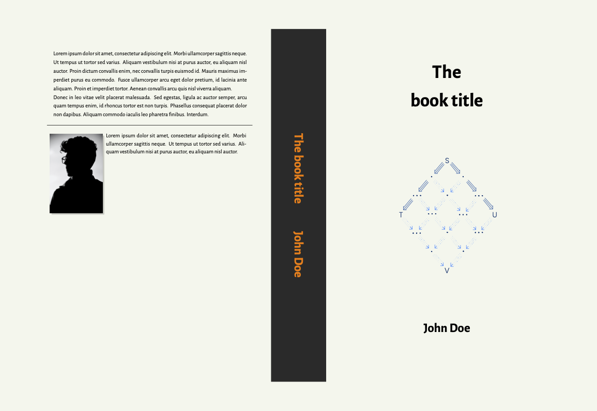

# How to create your own book cover in Latex



## Dependencies

This project is compiled using xelatex.

## Change cover dimentions

To change the cover dimentions you need to edit the file *cover.tex*. At the top of the file you have
```latex
\documentclass[
  coverheight=241.0mm,
  coverwidth=165.0mm, % (pagesize - spinewidth) / 2
  spinewidth=37.6mm,
  bleedwidth=20mm,
  11pt,
  marklength=0pt,
  ]{bookcover}
```

Simply change this measurements to the appropiate values for your book.

## Change cover content

To change the cover content you need to edit the *book-info.sty* file following the instructions in the comments.
You'll need to define
* book title
* author name
* front cover image
* author photo
* author information for back cover
* content to be presented in back cover

To change any other details about the cover such as font style and size, you will need to edit the latex files directly.

## How to compile

To compile the project run

```
make
```

## Example after printing
In the images bellow you can see how the cover will look like after printing.


<br>


## Credit

This cover template was generalized from the one provided in https://github.com/hmemcpy/milewski-ctfp-pdf.git.

In this repository you'll find a print ready edition of the book "Category Theory for Programmers" by Bartosz Milewski.
